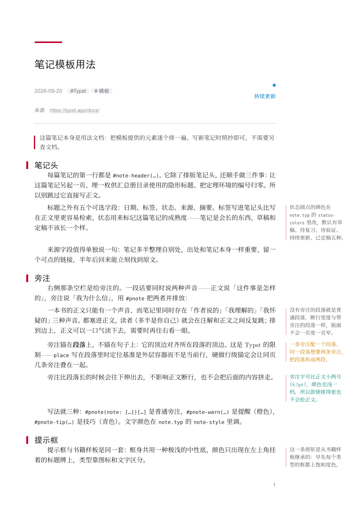
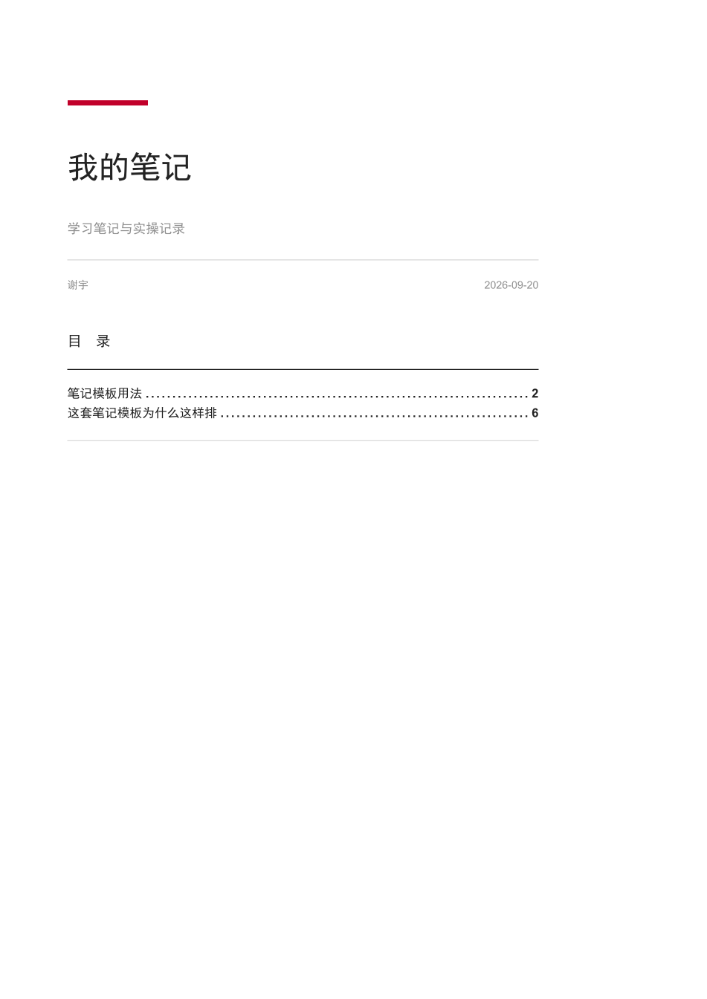
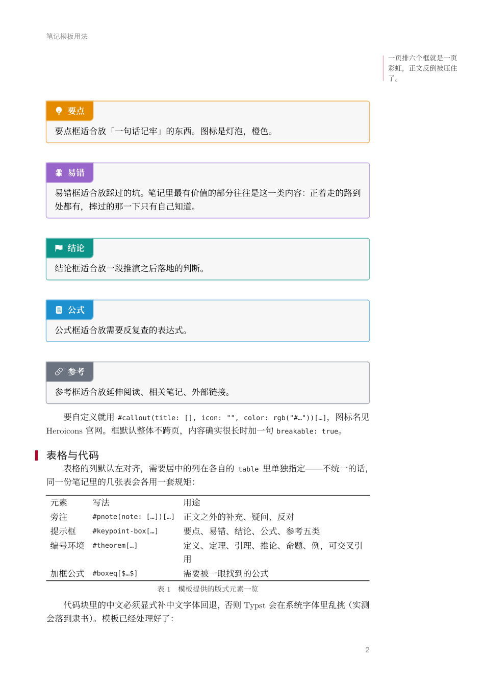
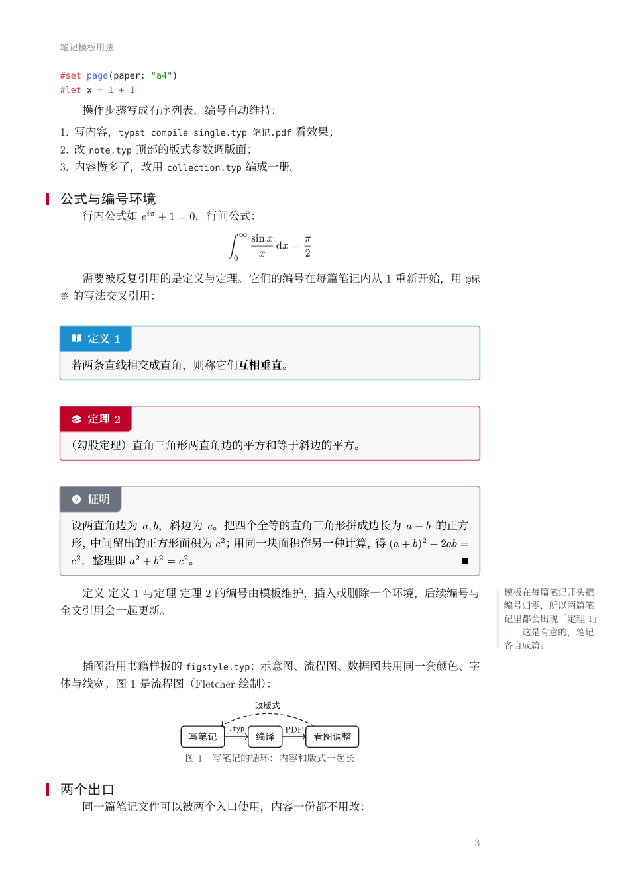

# typst-note-author

一个 Agent Skills 技能：用 Typst 排中文学习笔记。笔记头（日期/标签/状态/来源）、
右侧旁注栏、提示框与编号环境、三线表、图表公式与交叉引用开箱即用，
**单篇导出与汇总成册两个出口共用同一份内容**；配套脚本可把关键词与笔记结构
存入 SQLite，一键生成交互式**知识图谱**（[vis-network](https://github.com/visjs/vis-network)
力导向图：关键词为节点、共现为边，可拖动/缩放/点击高亮/搜索），
另有树状思维导图（[markmap](https://github.com/markmap/markmap)）作为层级视角补充。

风格与 `typst-book-author` 同源：配色、提示框、图形样式、中文字体规则都从那边
继承；骨架则换成了笔记的——不装订、不分篇、不做切口色标，右侧的宽边不是留给
订口的，是留给旁注的。

## 效果预览

| 笔记头 + 旁注 + 提示框 | 汇总册首页（自动总目录） |
| :---: | :---: |
|  |  |

| 提示框与三线表 | 编号环境与插图 |
| :---: | :---: |
|  |  |

## 目录结构

```
typst-note-author/
├── SKILL.md               技能入口：工作流程与四条必须记住的约定
├── README.md              本文件
├── preview/               效果预览图
├── references/            按需阅读的参考文档
│   ├── design.md          版式架构与设计意图（改模块前读）
│   ├── customization.md   常见定制任务（换色/调栏宽/换开本/扩框型…）
│   └── pitfalls.md        踩坑记录（旁注错位/缩进丢失/表格线异常…）
├── scripts/               notes_db.py（关键词/结构入库 SQLite + 生成知识图谱/思维导图）、
│                          check_sync.py（与 typst-book-author 的色值/图形样式同步校验）
└── template/              完整可编译的笔记样板
    ├── note.typ           核心：版式参数、字体、行内样式、笔记头、旁注
    ├── colors.typ         全部配色唯一来源
    ├── boxes.typ          提示框 / 编号环境 / 加框公式
    ├── figstyle.typ       CeTZ / Fletcher / Lilaq 统一图形样式
    ├── single.typ         单篇出口
    ├── collection.typ     汇总出口
    ├── .gitignore         编译产物与 notes_db 生成物（随模板复制）
    └── notes/             笔记正文（随附两篇既是示例也是用法文档）
```

## 安装

把本文件夹放进技能目录即可，支持 [Agent Skills](https://agentskills.io) 规范的工具会
自动发现：

```
~/.agents/skills/typst-note-author/       # 个人技能（所有项目可用）
<项目>/.agents/skills/typst-note-author/   # 仅当前项目
```

## 使用

对支持 Agent Skills 的 AI 编程助手说「帮我把这些笔记排一下」「用 Typst 写一篇
学习笔记」之类的话，技能会自动触发。也可以直接手动使用模板：

```bash
cp -r template/ mynotes/ && cd mynotes

# 单篇：改 single.typ 末尾 include 的那一行，然后
typst compile single.typ 笔记.pdf

# 汇总成册：在 collection.typ 里按顺序 include 各篇笔记
typst compile collection.typ 我的笔记.pdf

# 笔记项目位置：第一次问清存哪里并登记，之后所有命令不带 --root 都默认用它
# （存在 ~/.typst-note-author/state.json，环境变量 TYPST_NOTES_HOME 可覆盖）
python scripts/notes_db.py root D:/my-notes

# 关键词入库 SQLite，生成交互式知识图谱（vis-network；mindmap 子命令可出树状思维导图）
# 知识图谱会把每篇笔记逐篇编译到 notes-pdf/，点击笔记节点直接打开该篇 PDF
python scripts/notes_db.py sync
python scripts/notes_db.py graph --open

# 新笔记计数：每满 20 篇自动编译一次合集（合集-日期.pdf）并归零；
# collect 子命令可立即出合集
python scripts/notes_db.py bump
```

写一篇新笔记：在 `notes/` 下新建文件，先写 `#note-header(…)`，正文从 `==` 起。

要求 Typst 0.13+（用到的最新语法是 0.13 引入的 `first-line-indent` 配置；
实测 0.15.1），首次编译需联网拉取 `@preview` 依赖。
字体依赖：思源宋体（Noto Serif SC）、SimHei、KaiTi、New Computer Modern、
DejaVu Sans Mono。

## 依赖

- [showybox](https://typst.app/universe/package/showybox) 2.0.4（提示框框体）
- [heroic](https://typst.app/universe/package/heroic) 0.1.2（Heroicons 图标）
- [marginalia](https://typst.app/universe/package/marginalia) 0.3.1（行级旁注 `#mnote`）
- [cetz](https://typst.app/universe/package/cetz) 0.5.2 /
  [fletcher](https://typst.app/universe/package/fletcher) 0.5.8 /
  [lilaq](https://typst.app/universe/package/lilaq) 0.6.0 /
  [tiptoe](https://typst.app/universe/package/tiptoe) 0.4.0（图形）

不依赖 Bookly：笔记不需要书籍骨架，而脱离它之后标题与页面样式才完全可控
（Bookly 的标题由主题整块渲染，外部加 `show heading` 会把它顶掉）。

## 许可

MIT
